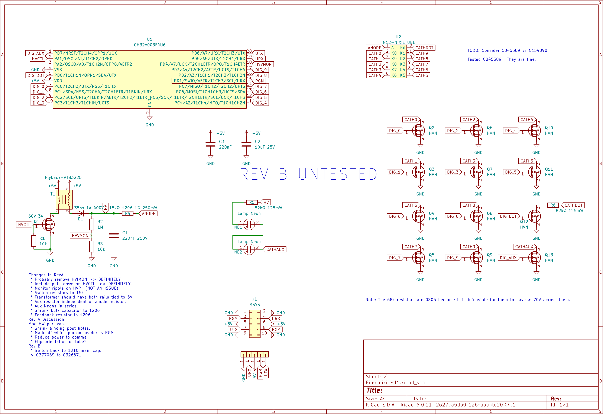
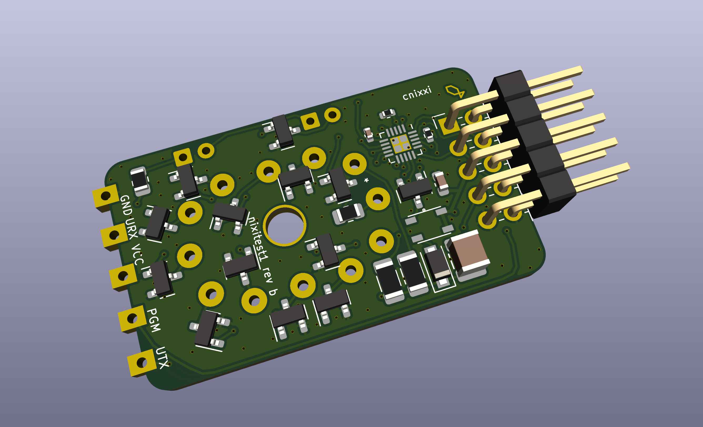

# cnixxi

My experiment with nixie tubes.

It uses a ch32v003 to both control the nixie tube's cathodes, as well as provide the 180V supply for the nixie tube.

Youtube video:

Schematic:

Board:

